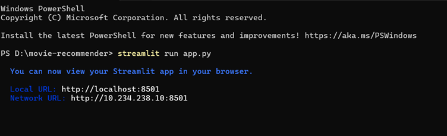
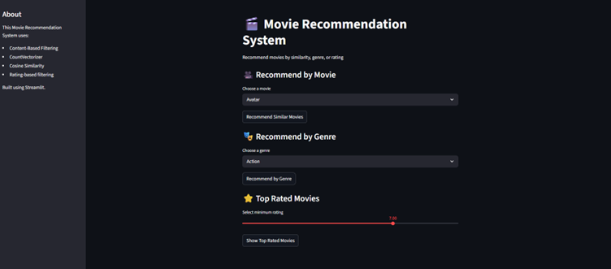
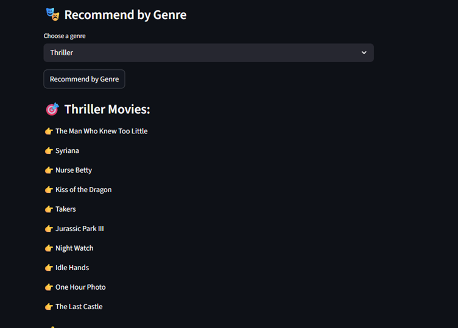
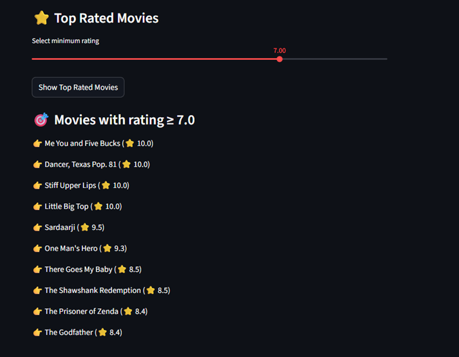

#  Movie Recommendation System

##  Overview

This project is a Machine Learning-based Movie Recommendation System that suggests movies based on user preferences such as movie selection, genre, and ratings. It uses a **content-based filtering approach** to recommend movies with similar features.

An interactive **Streamlit web application** is built to provide a clean and user-friendly interface for users.

---

##  Features

*  Recommend movies based on selected movie
*  Filter by genre (Action, Romance, Sci-Fi, etc.)
*  Filter by minimum rating
*  Fast recommendations using cosine similarity
*  Interactive UI using Streamlit

---

##  Tech Stack

* Python
* Pandas
* Scikit-learn
* Streamlit

---

##  Project Structure

```
Movie-Recommendation-System/
│── app.py                # Streamlit UI
│── movies.csv           # Dataset
│── main.py              # Entry point
│── README.md            # Project documentation
```

---

## ⚙️ Installation & Setup

### 1. Clone the repository

```bash
git clone https://github.com/your-username/movie-recommendation-system.git
cd movie-recommendation-system
```

### 2. Install dependencies

```bash
pip install -r requirements.txt
```

### 3. Run the application

```bash
streamlit run app.py
```

---

## 🖥️ Usage

1. Select a movie from the dropdown
2. Choose a genre (optional)
3. Set minimum rating
4. Click on "Recommend"
5. Get a list of recommended movies

---

##  Methodology

* Data preprocessing and cleaning
* Feature extraction using TF-IDF
* Similarity calculation using cosine similarity
* Filtering based on genre and rating

---

##  Example Output

The system displays a list of movies similar to the selected movie, filtered by genre and rating.

---






##  Limitations

* No user-based personalization
* Depends on dataset quality
* Limited to available features

---

##  Future Improvements

* Add movie posters (TMDB API)
* Hybrid recommendation system
* User login and history tracking
* Deploy on cloud (Streamlit Cloud)

---

##  Author

Yash Modi
25BAI11144

---

##  Acknowledgements

* Scikit-learn Documentation
* Streamlit Documentation
* Kaggle Datasets
 
